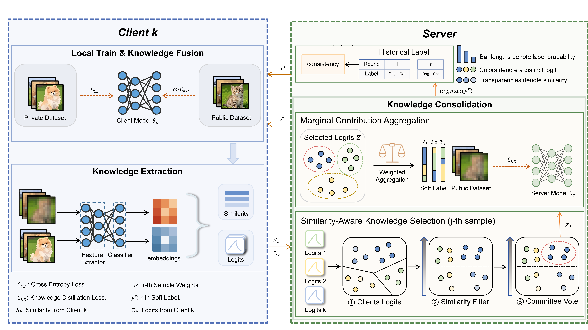

# FedSALT: Similarity-Aware Learning and Consistency Tracing for Federated Distillation under Label Shift

FedSALT is a federated distillation training project with two algorithm entry options:

- one-shot: single-round aggregation and distillation
- interation: multi-round iterative aggregation and distillation

## Abstract

Federated distillation (FD) methods assume that client predictions on shared public data are reliable for knowledge transfer. However, this assumption fails under label shift, where heterogeneous class distributions introduce two critical challenges: (1) Distributional misalignment causes local models to produce unreliable predictions for minority classes, leading to negative transfer. The predominant weighted-averaging aggregation assumes linear combinability of client predictions, an assumption violated under high heterogeneity, amplifying systematic biases. (2) Temporal inconsistency of pseudo-labels across communication rounds destabilizes the distillation process and impairs convergence. To address these problems, we propose Federated Similarity-Aware Learning and Consistency Tracking (FedSALT), which performs robust knowledge transfer through three components: a similarity-based knowledge selection mechanism, marginal contribution aggregation strategy, and a temporal consistency fusion mechanism. Extensive experiments demonstrate that FedSALT significantly outperforms baselines under diverse non-IID settings, achieving superior pseudo-label quality and stable convergence even under label shift and noisy clients.

## Method Overview

The following figure shows the overall pipeline of FedSALT.



## 1. Environment Setup

Python 3.10+ is recommended.

Install dependencies:

```bash
pip install -r requirements.txt
```

Notes:

- requirements.txt: minimal project dependencies (recommended)

## 2. How to Run

From the project root:

```bash
# Run one-shot
python src/main.py --alg one-shot

# Run interation
python src/main.py --alg interation
```

Arguments:

- --alg: algorithm type, one of one-shot or interation
- default: one-shot

## 3. Configuration

Main training settings are defined in src/config.py, for example:

- CLIENT_NUMBER
- CLIENT_LABELED_NUMBER
- CLIENT_PRE_LABELED_NUMBER
- SERVER_NUMBER
- BATCH_SIZE
- LR
- ROUNDS, EPOCHS
- SIMILARITY_MODE

## 4. Project Structure

```text
FedSALT/
|- src/
|  |- main.py                 # Main entry, switches algorithm by parameter
|  |- config.py               # Global configuration
|  |- dataset.py              # Data loading and dataset construction
|  |- alg/
|  |  |- one-shot.py          # one-shot algorithm
|  |  |- interation.py        # interation algorithm
|  |- training/
|  |  |- model.py             # student / teacher models
|  |  |- train.py             # training loop
|  |  |- evaluation.py        # evaluation and feature extraction
|  |- loss/
|  |  |- distillation.py      # distillation loss
|  |  |- hybrid.py            # hybrid loss
|  |- utils/
|  |  |- active_select.py     # client selection and aggregation
|  |  |- similarity.py        # similarity computation
|- requirements.txt
|- README.md
```

## 5. Output

- one-shot results are saved to result/one-shot/
- interation results are saved to result/interation/

Output directories are created automatically.

## 6. Common Issues

- The first run downloads MNIST and may take longer.
